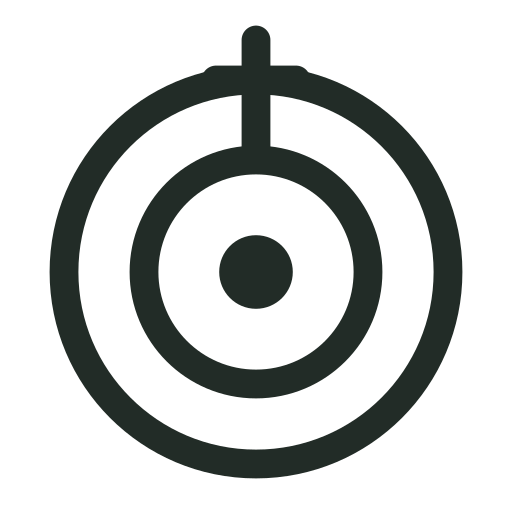
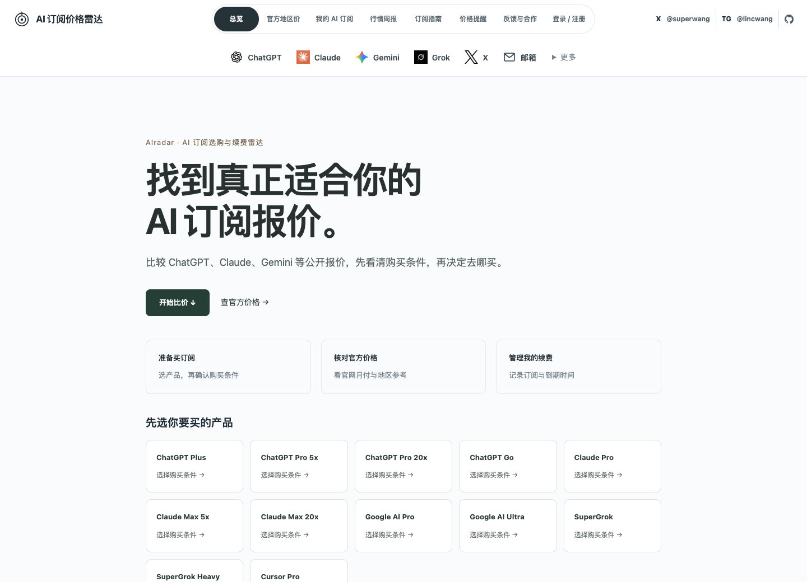

  

<h1 align="center">AIradar · AI 订阅选购与续费雷达</h1>

买 AI 订阅前，先看清价格和购买条件。 续费前，再回来看看有没有更合适的选择。

<strong><a href="https://airadar.vip/">立即查看报价 →</a></strong>　·　<a href="https://airadar.vip/official-prices">查官方价格</a>　·　<a href="https://airadar.vip/following">记录我的 AI 订阅</a>

网站实拍，2026-09-15。最新界面、报价与库存以网站为准。

## 你准备买哪个 AI？

| ChatGPT | Claude | 更多 AI |
| --- | --- | --- |
| [ChatGPT Plus →](https://airadar.vip/prices/chatgpt-plus) | [Claude Pro →](https://airadar.vip/prices/claude-pro) | [Google AI Pro →](https://airadar.vip/prices/gemini-pro) |
| [ChatGPT Pro 5x →](https://airadar.vip/prices/chatgpt-pro-5x) | [Claude Max 5x →](https://airadar.vip/prices/claude-max-5x) | [Google AI Ultra →](https://airadar.vip/prices/gemini-ultra) |
| [ChatGPT Pro 20x →](https://airadar.vip/prices/chatgpt-pro-20x) | [Claude Max 20x →](https://airadar.vip/prices/claude-max-20x) | [Cursor Pro →](https://airadar.vip/prices/cursor-pro) |
| [ChatGPT Go →](https://airadar.vip/prices/chatgpt-go) | [全部产品 →](https://airadar.vip/catalog) | [SuperGrok →](https://airadar.vip/prices/super-grok) |

## 从选购到续费，少做几次重复功课

**把同条件的价格放在一起看。** 区分代充、成品账号和共享方式，核对订阅期限、新开与续费条件。还没写清条件的报价保留价格，并标明待确认。

**看清一条价格为什么变化。** [行情周报](https://airadar.vip/weekly)记录实际观察到的变化；依据足够时，区分同店商品调价和新观察到的低价来源。也可以把具体规格和观察日期分享给朋友。[怎样区分商家调价与新增来源 →](https://airadar.vip/guides/read-price-changes)

**给下次续费留个提醒。** 在[我的 AI 订阅](https://airadar.vip/following)保存关注、目标价和到期日期，导出日历提醒。需要邮箱提醒时，再登录并自行开启。

不需要安装。**[打开 AIradar，看看你的订阅报价 →](https://airadar.vip/)**

## 第一次购买，也有参考

[订阅选购指南](https://airadar.vip/guides) · [如何比较价格](https://airadar.vip/help/compare-prices) · [如何设置提醒](https://airadar.vip/help/price-alerts)

报价来自公开商品信息，可查看来源与记录时间。信息不完整的报价不参与同规格最低价；历史不足时不推算行情。自然排名不因店铺收录、X 关联或推广而加权。

AIradar 提供信息查询与提醒。购买前请回原店核对最终价格、适用条件与售后规则。详情见[数据与排序说明](https://airadar.vip/help/data-and-ranking)。

## For English-speaking visitors

Compare public AI subscription offers by product, delivery method, duration and purchase conditions. Save a specific plan with an optional price or renewal reminder. The website is currently in Chinese.

**[Explore AIradar →](https://airadar.vip/)**

---

开发与部署：[开发文档](docs/development.md) · [源码目录](lib/)

反馈与合作：[反馈数据问题](https://airadar.vip/submit?type=feedback) · [提交店铺](https://airadar.vip/submit-shop) · [X / @superwang](https://x.com/superwang)
